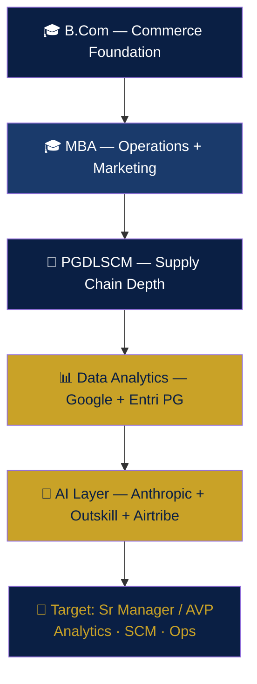

[🏠 Home](./README.md) · **🎓 Education** · [💼 Experience](./EXPERIENCE.md) · [🏅 Certifications](./CERTIFICATIONS.md) · [🚀 Projects](./PROJECTS.md) · [🧪 Simulations](./SIMULATIONS.md) · [✍️ Publications](./PUBLICATIONS.md)

---

## 🎓 Formal Degrees

| Qualification | Institution | Specialization | Result |
|---|---|---|---|
| 🎓 **Master of Business Administration (MBA)** | SRM Institute of Science & Technology, Chennai | Operations & Marketing (dual) | **First Class** |
| 🎓 **Bachelor of Commerce (B.Com)** | University of Madras | Commerce | Completed |
| 📜 **PG Diploma in Logistics & Supply Chain Management** | — | Logistics & SCM | Completed |

**Post-nominals:** B.Com, MBA, PGDLSCM, SSBB, SCPro, SFCA, GCDA, GCBI, GCPM

---

## 📚 Ongoing Structured Programs (2026–27)

| Program | Provider | Duration | Focus |
|---|---|---|---|
| 🧠 **AI-First Product Management** | Airtribe | Jun 2026 – Jan 2027 | Product sense · strategy · user research · frameworks (RICE, Five Forces, STP, JTBD) |
| 📊 **PG in Data Analytics** | Entri Elevate | Aug 2026 – Feb 2027 | Advanced analytics · SQL · Python · BI |
| ⚙️ **SAP MM — Logistics/SCM** | Entri Elevate | Jul 2026 – | Materials management · procurement · inventory |
| 🤖 **AI Generalist Program** | Outskill | Jun 2026 – Feb 2027 | LLMs · prompt engineering · RAG · AI agents |

---

## 🗣️ Languages

| Language | Level |
|---|---|
| 🇬🇧 English | Fluent — professional working |
| 🇮🇳 Hindi | Fluent |
| 🇮🇳 Tamil | Fluent (native) |
| 🇮🇳 Telugu | Fluent |
| 🇩🇪 German | A1 — in progress (EU Blue Card track) |

---

## 🧩 How the Education Stack Fits Together

> **The through-line:** commerce fundamentals → business management → supply chain specialization → data analytics capability → AI fluency. Each layer is applied in real projects — see [🚀 Projects](./PROJECTS.md).

---

[🏠 Back to Dashboard](./README.md)

