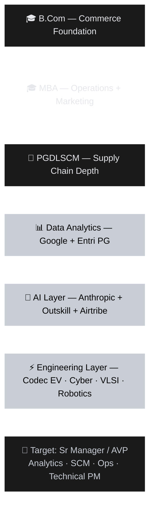

<!-- ═══════════════ HORIZON 2047 · EDUCATION ═══════════════ -->

   

<table><tbody>
<tr><td align="right"><b>WHO I AM</b></td><td>  </td></tr>
<tr><td align="right"><b>WHAT I BUILT</b></td><td>  </td></tr>
<tr><td align="right"><b>WHAT I CAN DO</b></td><td>  </td></tr>
<tr><td align="right"><b>WHERE I HAVE WORKED</b></td><td>  </td></tr>
<tr><td align="right"><b>HOW I WORK</b></td><td>   </td></tr>
<tr><td align="right"><b>WHY HIRE ME</b></td><td>     </td></tr>
</tbody></table>

## 🎓 Formal Degrees

| Qualification | Institution | Specialization | Result |
|---|---|---|---|
| 🎓 **Master of Business Administration (MBA)** | SRM Institute of Science & Technology, Chennai | Operations & Marketing (dual) | **First Class** |
| 🎓 **Bachelor of Commerce (B.Com)** | University of Madras | Commerce | Completed |
| 📜 **PG Diploma in Logistics & Supply Chain Management** | — | Logistics & SCM | Completed |

**Post-nominals:** B.Com, MBA, PGDLSCM, SSBB, SCPro, SFCA, GCDA, GCBI, GCPM

## 📚 Ongoing Structured Programs (2026–27)

| Program | Provider | Duration | Focus |
|---|---|---|---|
| 🧠 **AI-First Product Management** | Airtribe | Jun 2026 – Jan 2027 | Product sense · strategy · user research · frameworks (RICE, Five Forces, STP, JTBD) |
| 📊 **PG in Data Analytics** | Entri Elevate | Aug 2026 – Feb 2027 | Advanced analytics · SQL · Python · BI |
| ⚙️ **SAP MM — Logistics/SCM** | Entri Elevate | Jul 2026 – | Materials management · procurement · inventory |
| 🤖 **AI Generalist Program** | Outskill | Jun 2026 – Feb 2027 | LLMs · prompt engineering · RAG · AI agents |
| ⚡ **Engineering internship tracks ×4** | Codec Technologies India | Aug – Sep 2026 | EV · Cyber Security · Digital Electronics & VLSI · Robotics & Automation — [50 projects, 50 reports](https://github.com/Eswar5313/Codec-Technologies-Internship-Portfolio-2026) |
| 🔵 **Blue Team / SOC training** | GraySentinel Cyber Defence Lab | Jul 2026 – | Defensive security operations |

## 🗣️ Languages

| Language | Level |
|---|---|
| 🇬🇧 English | Fluent — professional working |
| 🇮🇳 Hindi | Fluent |
| 🇮🇳 Tamil | Fluent (native) |
| 🇮🇳 Telugu | Fluent |
| 🇩🇪 German | A1 — in progress (EU Blue Card track) |

## 🧩 How the Education Stack Fits Together

```mermaid
%%{init: {'theme':'base','themeVariables':{'primaryColor':'#222222','primaryTextColor':'#FFFFFF','primaryBorderColor':'#FFFFFF','lineColor':'#FFFFFF','secondaryColor':'#000000','tertiaryColor':'#1A1A1A','cScale0':'#222222','cScale1':'#3A3A3A','cScale2':'#1A1A1A','cScale3':'#2A2A2A','pie1':'#FFFFFF','pie2':'#C9CDD6','pie3':'#9A9A9A','pie4':'#6A6A6A','pie5':'#3A3A3A','pie6':'#1A1A1A','fontFamily':'Georgia, serif'}}}%%
flowchart TD
    A[🎓 B.Com — Commerce Foundation] --> B[🎓 MBA — Operations + Marketing]
    B --> C[📜 PGDLSCM — Supply Chain Depth]
    C --> D[📊 Data Analytics — Google + Entri PG]
    D --> E[🤖 AI Layer — Anthropic + Outskill + Airtribe]
    E --> G[⚡ Engineering Layer — Codec EV · Cyber · VLSI · Robotics]
    G --> F[🎯 Target: Sr Manager / AVP\nAnalytics · SCM · Ops · Technical PM]
    style A fill:#1A1A1A,color:#E5E7EB
    style B fill:#FFFFFF,color:#E5E7EB
    style C fill:#1A1A1A,color:#E5E7EB
    style D fill:#C9CDD6,color:#000000
    style E fill:#C9CDD6,color:#000000
    style G fill:#C9CDD6,color:#000000
    style F fill:#1A1A1A,color:#C9CDD6
```

> **The through-line:** commerce fundamentals → business management → supply chain specialization → data analytics capability → AI fluency → hands-on engineering (RTL, robotics, EV, defensive security). Each layer is applied in real projects — see [🚀 Projects](./PROJECTS.md).

**Eswar Mahalingam** · MBA · CSCMP SCPro · Six Sigma Black Belt · Ghaziabad NCR, India · Open to India · EU (Blue Card) · Gulf · Immediate joiner

