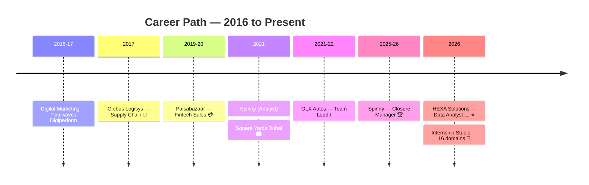

[🏠 Home](./README.md) · [🎓 Education](./EDUCATION.md) · **💼 Experience** · [🏅 Certifications](./CERTIFICATIONS.md) · [🚀 Projects](./PROJECTS.md) · [🧪 Simulations](./SIMULATIONS.md) · [✍️ Publications](./PUBLICATIONS.md)

---

## 🗂️ View 1 — Sector-Wise

📊 <b>Data & Analytics</b> — current core

 

| Role | Company | Period | What I Deliver |
|---|---|---|---|
| 🟢 **Data Analyst** | HEXA Solutions, Ghaziabad | Jun 2026 – Present | 13-project analytics portfolio (EDA, SQL, ML, API pipelines, dashboards) · weekly learning decks · CRISP-DM workflow |
| 🤖 **AI Trainer** *(freelance)* | micro1 | Aug 2026 – Present | Evaluating AI-generated responses against guidelines · structured feedback for model improvement |
| 📈 **Data Science & Analytics** *(project-based)* | Zidio Development | Aug 2026 – Present | Data cleaning · predictive modeling · dashboards · Python/SQL/R |
| ⚙️ **Data Analytics + AI Engineer track** *(project-based)* | CadetX | Aug 2026 – Present | Excel, SQL, Power BI business assignments |

🚚 <b>Supply Chain & Logistics</b>

 

| Role | Company | Period | Impact |
|---|---|---|---|
| 📦 **Management Trainee** | Globus Logisys | May – Dec 2017 | **30% stockout reduction** · **22% cycle-delay cut** · warehouse & inventory operations |

*Reinforced by PGDLSCM, CSCMP SCPro, IIM-A SC Digitization, Six Sigma Black Belt — see [Certifications](./CERTIFICATIONS.md)*

🚗 <b>Automotive</b>

 

| Role | Company | Period | Impact |
|---|---|---|---|
| 🏆 **Closure Manager** | Spinny | Jun 2025 – Mar 2026 | **250+ deals closed** · **18% closure-rate lift** · 14% closure-time cut · 4.8/5 CSAT · **Top Closure Consultant Q2** |
| 📞 **Sr. Customer Service Advisor & Team Lead** | OLX Autos | Dec 2021 – Feb 2022 | **87% first-contact resolution** · team leadership |
| 📊 **Sales Analyst** | Spinny | Feb – May 2021 | Sales pipeline analysis & reporting |

💳 <b>Fintech</b>

 

| Role | Company | Period | Impact |
|---|---|---|---|
| 💰 **Sales Consultant** | Paisabazaar | Oct 2019 – Jun 2020 | **28% conversion** · **₹1.5Cr+ monthly loan disbursals facilitated** |

🏙️ <b>Luxury Real Estate — International</b>

 

| Role | Company | Period | Impact |
|---|---|---|---|
| 🌍 **Associate Portfolio Manager** | Square Yards, Dubai 🇦🇪 | Sep – Nov 2021 | **100+ HNI accounts** · clients from **15+ nationalities** · **90%+ retention** |

📣 <b>Digital Marketing & Design</b>

 

| Role | Company | Period | Impact |
|---|---|---|---|
| 🎨 **UX Design Intern** | GWEN | Aug 2026 – Present | Figma flows, wireframes, prototypes · user research · A/B testing · reference letter received |
| 📱 **Digital Marketing** | Tidalwave Solutions / Digiperform | 2016 – 17 | Campaign execution & digital foundations |

---

## 🎭 View 2 — Role-Wise (What I Bring to Bigger Roles)

| Role Lens | Evidence Across Career |
|---|---|
| 📊 **The Analyst** | HEXA 13 projects · Spinny sales analysis · Excel/SQL/Python/BI stack · verified figures discipline |
| 💼 **The Closer** | ₹13.5Cr+ facilitated · 28% conversion (Paisabazaar) · 250+ deals & Top Consultant (Spinny) |
| 👥 **The Team Lead** | OLX team leadership · 87% FCR · mentoring & escalation handling |
| 🌍 **The International Operator** | Dubai HNI portfolio · 15+ nationalities · 4 languages · EU Blue Card track |
| 🚚 **The Ops Improver** | 30% stockout ↓ · 22% cycle-delay ↓ · Six Sigma Black Belt DMAIC mindset |
| 🤖 **The AI-Fluent Professional** | micro1 AI training · 4 Anthropic certifications · AI-First PM cohort · RAG/agents study |
| 🧩 **The Versatile Experience Holder** | 16 Internship Studio domains in one year — AI, engineering, finance, HR, cloud, design, marketing — each closed with a verified deliverable (View 3 below) |

---

## 🧩 View 3 — The Versatile Experience Holder (Internship Studio 2026 · 16 Domains)

> Alongside the core analytics role I completed a **16-domain internship programme** — each track ending in a real, evaluated project. The table is deliberately separate from the sector view above: it is the evidence that I can be dropped into an unfamiliar function, read its brief, and ship a verified deliverable in its own professional language — code, calculations, drawings, workbooks, policies or campaigns.

| # | Domain | Role I played | Delivered | Skill proven | Evidence |
|---|---|---|---|---|---|
| 01 | **Artificial Intelligence** | 🛡️ Project Panopticon | Precision **1.00** at 0.90 threshold · 0 innocent students flagged | Time-series ML · ethics-aware thresholds | [Report](https://github.com/YOUR-USERNAME/Internship-Studio-Projects-2026/blob/main/01-Artificial-Intelligence/AI_Project_Report.pdf) · [Repo](https://github.com/YOUR-USERNAME/exam-proctoring-ai-panopticon) |
| 02 | **Data Science** | 🏭 Project Overheat | **3/3** failures warned 24 h early · 0 nuisance alerts | Feature engineering · leakage-safe validation | [Report](https://github.com/YOUR-USERNAME/Internship-Studio-Projects-2026/blob/main/02-Data-Science/Data_Science_Project_Report.pdf) · [Repo](https://github.com/YOUR-USERNAME/predictive-maintenance-iot-ml) |
| 03 | **Software Testing** | 🧪 OrderFlow test-suite optimisation | APFD **75.8% → 89.2%** · suite −62.8% time | Test prioritisation · APFD · set cover | [Report](https://github.com/YOUR-USERNAME/Internship-Studio-Projects-2026/blob/main/03-Software-Testing/Software_Testing_Project_Report.pdf) · [Repo](https://github.com/YOUR-USERNAME/regression-test-prioritisation-apfd) |
| 04 | **C++ & Data Structures** | 📚 Smart Library Management System | `-Wall` clean · **valgrind 0 leaks** · 10/10 menu options | OOP · linked list · stack · queue | [Report](https://github.com/YOUR-USERNAME/Internship-Studio-Projects-2026/blob/main/04-CPP-Data-Structures/CPP_DSA_Project_Report.pdf) · [Repo](https://github.com/YOUR-USERNAME/smart-library-management-cpp) |
| 05 | **Energy Conservation & Mgmt** | ⚡ Textile electricity-bill audit | Rs 10.76 Cr bill · **Rs 81.9 L (7.6%) savings** | Tariff modelling · energy economics | [Report](https://github.com/YOUR-USERNAME/Internship-Studio-Projects-2026/blob/main/05-Energy-Conservation-Management/Energy_Audit_Report.pdf) · [Repo](https://github.com/YOUR-USERNAME/textile-electricity-bill-energy-audit) |
| 06 | **RCC Structure Design** | 🏗️ RCC slab · beam · column (IS 456) | **14/14** design checks pass | Limit-state design · structural checks | [Report](https://github.com/YOUR-USERNAME/Internship-Studio-Projects-2026/blob/main/06-RCC-Structure-Design/RCC_Design_Project_Report.pdf) · [Repo](https://github.com/YOUR-USERNAME/rcc-structural-design-is456) |
| 07 | **Web Development** | 🛒 CartShare | **54/54** e2e checks · live cross-tab sync | HTML/CSS/JS · Bootstrap · GitHub Pages | [Live app](https://YOUR-USERNAME.github.io/cartshare-collaborative-cart/) · [Repo](https://github.com/YOUR-USERNAME/cartshare-collaborative-cart) |
| 08 | **AutoCAD Essentials** | 📐 Civil plan · electrical schematic · screw jack | **1,230 entities** · audit 0 errors | Drafting · DXF · layers & title blocks | [Report](https://github.com/YOUR-USERNAME/Internship-Studio-Projects-2026/blob/main/08-AutoCAD-Essentials/AutoCAD_Project_Report.pdf) · [Repo](https://github.com/YOUR-USERNAME/autocad-drawings-civil-electrical-mechanical) |
| 09 | **Finance** | 💹 Finance cases + Aurora ratio analysis | Aurora ROE **20% → 22.5%** · BUY/ACCUMULATE | Ratio analysis · dilution modelling | [Report](https://github.com/YOUR-USERNAME/Internship-Studio-Projects-2026/blob/main/09-Finance/Finance_Project_Report.pdf) · [Repo](https://github.com/YOUR-USERNAME/financial-ratio-analysis-aurora-foods) |
| 10 | **Excel Automation** | 📊 Multi-Region Sales Dashboard | **₹14.26 Cr = 101%** of target · 12,621 formulas | Excel Tables · SUMIFS pivots · dashboards | [Report](https://github.com/YOUR-USERNAME/Internship-Studio-Projects-2026/blob/main/10-Excel-Automation/Excel_Dashboard_Project_Report.pdf) · [Repo](https://github.com/YOUR-USERNAME/multi-region-sales-dashboard-excel) |
| 11 | **Human Resources** | 🧑‍💼 ABC Co. HR framework | 18-page manual · budget **Rs 5,714/employee** | Onboarding · discipline · engagement policy | [Report](https://github.com/YOUR-USERNAME/Internship-Studio-Projects-2026/blob/main/11-Human-Resources/HR_Project_Report.pdf) · [Repo](https://github.com/YOUR-USERNAME/hr-policy-framework-onboarding-engagement) |
| 12 | **Machine Learning** | 🎓 Student Performance regression | Ridge **R² 0.8805 · MAE 4.21** | Model comparison · pipelines | [Report](https://github.com/YOUR-USERNAME/Internship-Studio-Projects-2026/blob/main/12-Machine-Learning/ML_Project_Report.pdf) · [Repo](https://github.com/YOUR-USERNAME/student-performance-ml-regression) |
| 13 | **AWS** | ☁️ EC2 + S3 Node.js gallery · ROS on EC2 | App proven (7/7 tests) · 11 clean scripts | Cloud deployment · IAM/SSM · DevOps scripts | [Report](https://github.com/YOUR-USERNAME/Internship-Studio-Projects-2026/blob/main/13-AWS-Cloud/AWS_Project_Report.pdf) · [Repo](https://github.com/YOUR-USERNAME/aws-ec2-s3-nodejs-ros-deployment) |
| 14 | **Corporate Psychology** | 🧠 TechX Thrive well-being programme | 5 pillars · 20 KPIs · **₹1.21 Cr** plan | Programme design · evaluation research | [Report](https://github.com/YOUR-USERNAME/Internship-Studio-Projects-2026/blob/main/14-Corporate-Psychology/Corporate_Psychology_Project_Report.pdf) · [Repo](https://github.com/YOUR-USERNAME/employee-wellbeing-program-techx) |
| 15 | **Graphic Design** | 🎨 Seven Illustrator assignments | **34 original SVGs** · portfolio PDF | Vector design · branding · typography | [Report](https://github.com/YOUR-USERNAME/Internship-Studio-Projects-2026/blob/main/15-Graphic-Design-Illustrator/Illustrator_Portfolio_Eswar_Mahalingam.pdf) · [Repo](https://github.com/YOUR-USERNAME/illustrator-vector-design-portfolio) |
| 16 | **Digital Marketing** | 📣 EcoStyle Facebook campaign | **ROAS 4.53× · CPA Rs 331 · +23.5%** sales | Funnel modelling · A/B testing · creatives | [Report](https://github.com/YOUR-USERNAME/Internship-Studio-Projects-2026/blob/main/16-Digital-Marketing/Digital_Marketing_Project_Report.pdf) · [Repo](https://github.com/YOUR-USERNAME/ecostyle-facebook-ads-campaign-plan) |

🧭 <b>What this breadth adds to a senior role</b>

 

| Situation a senior manager faces | Domain I have already worked in |
|---|---|
| Sign off a capex case with engineering | RCC design · energy audit · AutoCAD drawings |
| Challenge a data-science team's model | Proctoring AI · predictive maintenance · ML regression |
| Judge a vendor's software quality | Test prioritisation · C++ engineering · web app delivery |
| Approve a marketing or HR budget | Meta campaign funnel · HR engagement budget · well-being programme |
| Read a balance sheet or a cloud bill | Ratio analysis · AWS deployment cost table |

🖥️ [Interactive dashboard](https://YOUR-USERNAME.github.io/Internship-Studio-Projects-2026/) · 📦 [Umbrella repository](https://github.com/YOUR-USERNAME/Internship-Studio-Projects-2026)

---

## 🕐 Timeline

> **Why the breadth matters:** most analysts have seen one industry's data. I've operated inside six industries and delivered in sixteen functional domains — so when I analyze a supply chain, a sales funnel, or a customer-service queue, I've *worked* the process behind the numbers.

---

[🏠 Back to Dashboard](./README.md)

