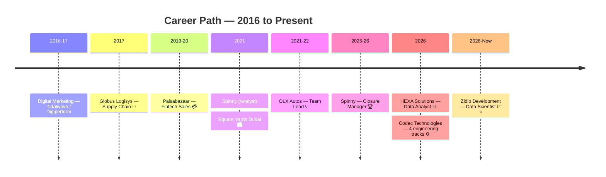

[🏠 Home](./README.md) · [🎓 Education](./EDUCATION.md) · **💼 Experience** · [🏅 Certifications](./CERTIFICATIONS.md) · [🚀 Projects](./PROJECTS.md) · [🧪 Simulations](./SIMULATIONS.md) · [✍️ Publications](./PUBLICATIONS.md)

---

## 🗂️ View 1 — Sector-Wise

📊 <b>Data & Analytics</b> — current core

 

| Role | Company | Period | What I Deliver |
|---|---|---|---|
| 🟢 **Data Scientist** — Data Science & Analytics | Zidio Development *(remote)* | Jul 2026 – Present | Data cleaning · predictive modeling (Project FORESIGHT demand forecast) · dashboards · Python/SQL/R |
| 📊 **Data Analyst** | HEXA Solutions, Ghaziabad | Jun – Sep 2026 | 13-project analytics portfolio (EDA, SQL, ML, API pipelines, dashboards) · weekly learning decks · CRISP-DM workflow · Completion + Experience Certificate |
| 🤖 **AI Trainer** *(freelance)* | micro1 | Aug 2026 – Present | Evaluating AI-generated responses against guidelines · structured feedback for model improvement |
| ⚙️ **Data Analytics + AI Engineer track** *(project-based)* | CadetX | Aug 2026 – Present | Excel, SQL, Power BI business assignments |

⚙️ <b>Engineering & Security — 2026 internship tracks</b>

 

| Role | Company | Period | What I Delivered |
|---|---|---|---|
| 🔌 **Digital Electronics & VLSI Intern** | Codec Technologies India *(remote)* | Aug 2026 – Present | [10 RTL/FPGA/ASIC projects](https://github.com/Eswar5313/Codec-Technologies-Internship-Portfolio-2026/tree/main/Digital-Electronics-VLSI) — Verilog/VHDL, self-checking testbenches, Yosys + nextpnr place-and-route (UART **135 MHz**), low-power ALU **−63.8 %**, own RTL-to-GDSII flow |
| 🤖 **Robotics & Automation Intern** | Codec Technologies India *(remote)* | Aug 2026 – Present | [10 simulation projects](https://github.com/Eswar5313/Codec-Technologies-Internship-Portfolio-2026/tree/main/Robotics-Automation) — A*/Dijkstra AMR (**0 collisions**), Kalman + PID balancing, SLAM search & rescue, drone surveillance, conveyor vision **99.7 %** · 143 tests |
| ⚡ **Electric Vehicle Intern** | Codec Technologies India *(remote)* | Aug 2026 – Present | [10 EV projects](https://github.com/Eswar5313/Codec-Technologies-Internship-Portfolio-2026/tree/main/Electric-Vehicle) — BMS with EKF (SOC RMSE **0.63 %**), solar charging techno-economics on NASA POWER data, drivetrain, wireless charging, IEA market forecast · 226 tests |
| 🛡️ **Cyber Security Intern** | Codec Technologies India *(remote)* | Aug 2026 – Present | [20 defensive projects](https://github.com/Eswar5313/Codec-Technologies-Internship-Portfolio-2026/tree/main/Cyber-Security) — IDS on NSL-KDD (F1 0.998), phishing detection, ransomware-behaviour detector, forensics, honeypot · 226 tests |
| 🔵 **Blue Team Operator & Trainee** | GraySentinel Cyber Defence Lab | Jul 2026 – Present | Guided zero-day discovery and attack-chain labs · Sigma detection rules · defensive reports |

*All 50 Codec projects: one repo, one dashboard → [https://eswar5313.github.io/Codec-Technologies-Internship-Portfolio-2026/](https://eswar5313.github.io/Codec-Technologies-Internship-Portfolio-2026/)*

🚚 <b>Supply Chain & Logistics</b>

 

| Role | Company | Period | Impact |
|---|---|---|---|
| 📦 **Management Trainee** | Globus Logisys | May – Dec 2017 | **30% stockout reduction** · **22% cycle-delay cut** · warehouse & inventory operations |

*Reinforced by PGDLSCM, CSCMP SCPro, IIM-A SC Digitization, Six Sigma Black Belt — see [Certifications](./CERTIFICATIONS.md)*

🚗 <b>Automotive</b>

 

| Role | Company | Period | Impact |
|---|---|---|---|
| 🏆 **Closure Manager** | Spinny | Jun 2025 – Mar 2026 | **250+ deals closed** · **18% closure-rate lift** · 14% closure-time cut · 4.8/5 CSAT · **Top Closure Consultant Q2** |
| 📞 **Sr. Customer Service Advisor & Team Lead** | OLX Autos | Dec 2021 – Feb 2022 | **87% first-contact resolution** · team leadership |
| 📊 **Sales Analyst** | Spinny | Feb – May 2021 | Sales pipeline analysis & reporting |

💳 <b>Fintech</b>

 

| Role | Company | Period | Impact |
|---|---|---|---|
| 💰 **Sales Consultant** | Paisabazaar | Oct 2019 – Jun 2020 | **28% conversion** · **₹1.5Cr+ monthly loan disbursals facilitated** |

🏙️ <b>Luxury Real Estate — International</b>

 

| Role | Company | Period | Impact |
|---|---|---|---|
| 🌍 **Associate Portfolio Manager** | Square Yards, Dubai 🇦🇪 | Sep – Nov 2021 | **100+ HNI accounts** · clients from **15+ nationalities** · **90%+ retention** |

📣 <b>Digital Marketing & Design</b>

 

| Role | Company | Period | Impact |
|---|---|---|---|
| 🎨 **UX Design Intern** | GWEN | Aug 2026 – Present | Figma flows, wireframes, prototypes · user research · A/B testing · reference letter received |
| 📱 **Digital Marketing** | Tidalwave Solutions / Digiperform | 2016 – 17 | Campaign execution & digital foundations |

---

## 🎭 View 2 — Role-Wise (What I Bring to Bigger Roles)

| Role Lens | Evidence Across Career |
|---|---|
| 📊 **The Analyst** | HEXA 13 projects · Zidio forecasting · Spinny sales analysis · Excel/SQL/Python/BI stack · verified figures discipline |
| ⚙️ **The Engineer-Analyst** | 50 Codec projects across VLSI, robotics, EV and cyber — RTL timing reports, robot simulations and detection models, all with tests and reports |
| 💼 **The Closer** | ₹13.5Cr+ facilitated · 28% conversion (Paisabazaar) · 250+ deals & Top Consultant (Spinny) |
| 👥 **The Team Lead** | OLX team leadership · 87% FCR · mentoring & escalation handling |
| 🌍 **The International Operator** | Dubai HNI portfolio · 15+ nationalities · 4 languages · EU Blue Card track |
| 🚚 **The Ops Improver** | 30% stockout ↓ · 22% cycle-delay ↓ · Six Sigma Black Belt DMAIC mindset |
| 🤖 **The AI-Fluent Professional** | micro1 AI training · 4 Anthropic certifications · AI-First PM cohort · RAG/agents study |

---

## 🕐 Timeline

> **Why the breadth matters:** most analysts have seen one industry's data. I've operated inside seven — so when I analyze a supply chain, a sales funnel, or a customer-service queue, I've *worked* the process behind the numbers.

---

[🏠 Back to Dashboard](./README.md)

