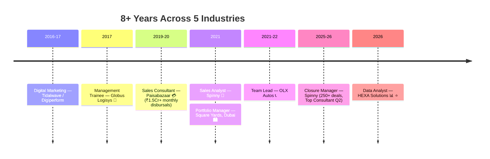

<!-- ═══════════════ HEADER ═══════════════ -->

### 🗂️ Open a Panel in Full

<!-- ═══════════════ KPI STRIP ═══════════════ -->

## 📟 Career KPI Board

---

<!-- ═══════════════ DASHBOARD GRID ROW 1 ═══════════════ -->
<table width="100%">
<tr>
<td width="50%" valign="top">

### 🟢 LIVE — Current Panel

| Signal | Status |
|---|---|
| 💼 **Role** | Data Analyst @ **HEXA Solutions** |
| 📍 **Base** | Ghaziabad, NCR, India |
| ⚡ **Side engagements** | micro1 (AI Trainer) · Zidio (DS&A) · CadetX (Analytics+AI) · GWEN (UX) — *freelance/project* |
| 📚 **Learning** | AI-First PM · RAG & Agents · SAP MM · German A1 🇩🇪 |
| 🎯 **Targeting** | Sr Manager / AVP — Analytics · SCM · Ops |
| 🌍 **Open to** | India · EU (Blue Card) · Gulf · Immediate |

</td>
<td width="50%" valign="top">

### 🧠 Skill Radar

| Domain | Level |
|---|---|
| 📊 Excel / Dashboards | 🟨🟨🟨🟨🟨 |
| 🔍 EDA & Statistics | 🟨🟨🟨🟨⬜ |
| 🗃️ SQL | 🟨🟨🟨🟨⬜ |
| 🐍 Python (Pandas/Sklearn) | 🟨🟨🟨🟨⬜ |
| 📈 Power BI / Tableau | 🟨🟨🟨🟨⬜ |
| 🤖 AI Tools / Prompting | 🟨🟨🟨🟨🟨 |
| 🚚 Supply Chain Ops | 🟨🟨🟨🟨🟨 |

</td>
</tr>
</table>

---

<!-- ═══════════════ TECH TICKER ═══════════════ -->

### 🛠️ Tool Belt

---

<!-- ═══════════════ DASHBOARD GRID ROW 2 ═══════════════ -->
<table width="100%">
<tr>
<td width="50%" valign="top">

### 📊 Portfolio Panel — Repos

| Repo | Contents |
|---|---|
| 📊 [`hexa-data-analytics-portfolio`](https://github.com/YOUR-USERNAME/hexa-data-analytics-portfolio) | **13 projects** — EDA · SQL · ML · API · dashboards |
| 🧭 [`product-management-case-studies`](https://github.com/YOUR-USERNAME/product-management-case-studies) | **7 cases** — Uber · Zepto · Nykaa · B2B SaaS · Blinkit |

**Verified headline figures:**
🏙️ Dubai model → **99 AED/sqft** · 🛒 Flipkart CSAT → **4.48→3.66** · ⌚ Fitness corr → **r = −0.60**

➡️ [All 20+ projects in detail](./PROJECTS.md) · [🧪 66 job simulations](./SIMULATIONS.md) · [✍️ Publications](./PUBLICATIONS.md)

</td>
<td width="50%" valign="top">

### 🏅 Credential Panel

🚚 <b>Supply Chain</b> (8)

IIM Ahmedabad SC Digitization · CSCMP SCPro (6 domains) · Six Sigma Black Belt · PGDLSCM · PepsiCo SC Stars · Flipkart SCOA · 2× LinkedIn Learning SCM

📊 <b>Data & BI</b> (5)

Google Data Analytics · Google BI · Google Project Mgmt · Entri PG Data Analytics *(in progress)* · 66 Forage simulations

🤖 <b>AI</b> (7)

Anthropic AI Fluency ×2 · Claude 101 · Agent Skills · Outskill AI Generalist · Airtribe AI-First PM · Azure AI path *(in progress)*

💼 <b>Sales & CRM</b> (3)

Salesforce Administrator · PepsiCo Sales Star · SAP MM *(in progress)*

</td>
</tr>
</table>

---

<!-- ═══════════════ EXPERIENCE TIMELINE ═══════════════ -->
## 🕐 Journey Monitor

| 🏢 | Role | Key Number |
|---|---|---|
| **HEXA Solutions** | Data Analyst 🟢 | 13-project portfolio |
| **Spinny** | Closure Manager | 250+ deals · **18% closure lift** · 4.8/5 CSAT |
| **Square Yards, Dubai** | Portfolio Manager | 100+ HNI · 15+ nationalities · **90% retention** |
| **Paisabazaar** | Sales Consultant | **28% conversion** · ₹1.5Cr+/month |
| **OLX Autos** | Team Lead | **87% FCR** |
| **Globus Logisys** | Mgmt Trainee | **30% stockout ↓** · 22% cycle-delay ↓ |

---

<!-- ═══════════════ EDUCATION + STATS ═══════════════ -->
<table width="100%">
<tr>
<td width="45%" valign="top">

### 🎓 Education Panel

| Degree | Institution |
|---|---|
| **MBA** — Ops & Marketing *(First Class)* | SRM IST, Chennai |
| **B.Com** | University of Madras |
| **PG Diploma** — Logistics & SCM | — |

**Languages:** English · Hindi · Tamil · Telugu · German 🇩🇪 A1

</td>
<td width="55%" valign="top">

### 📈 GitHub Telemetry

</td>
</tr>
</table>

---

<!-- ═══════════════ CONTACT FOOTER ═══════════════ -->

## 📡 Comms Panel

**Open to Senior Manager / AVP roles — Data Analytics · Supply Chain · Operations**
🇮🇳 PAN-India · 🇪🇺 Germany (Blue Card track) · 🌴 Gulf | Immediate joiner

