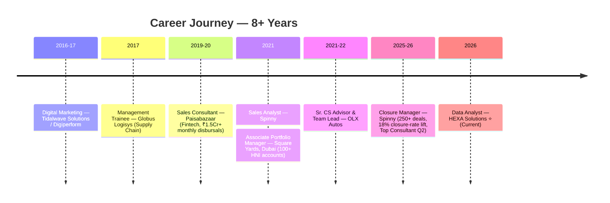

<!-- ═══════════════ HEADER BANNER ═══════════════ -->

---

## 🧭 About Me

> **Data Analyst @ HEXA Solutions** with **8+ years** of cross-functional experience across **supply chain & logistics, fintech, automotive sales, and luxury real estate (Dubai)** — now building at the intersection of **data analytics, operations, and AI**.

- 🔭 Currently: Data Analyst at **HEXA Solutions**, Ghaziabad NCR
- 📊 Verified career impact: **₹13.5Cr+ sales facilitated** · **28% conversion** · **30% stockout reduction** · **22% cycle-delay reduction** · **92%+ CSAT**
- 🎓 **MBA (Operations & Marketing)** — SRM IST Chennai · **Six Sigma Black Belt** · **CSCMP SCPro**
- 🤖 Learning: AI-First Product Management, RAG & AI Agents, SAP MM, German (A1 🇩🇪)
- 🌍 Languages: English · Hindi · Tamil · Telugu
- 🎯 Targeting: **Senior Manager / AVP** roles in Data Analytics, Supply Chain & Operations — India · EU · Gulf

---

## 🛠️ Tech Stack & Tools

### 📊 Data & Analytics

### 🤖 AI & Machine Learning

### ⚙️ Business & Ops

---

## 🏅 Certifications — By Sector

🚚 <b>Supply Chain & Operations</b> — <i>click to expand</i>

 

| Certification | Issuer | Highlight |
|---|---|---|
| 🏆 **Supply Chain Digitization: Strategy & Design** | IIM Ahmedabad (Coursera) | Verify: `5F8VUMDUFHPS` |
| 🏆 **CSCMP SCPro** | Council of Supply Chain Management Professionals | All 6 domains |
| 🏆 **Six Sigma Black Belt** | Certified | Process excellence & DMAIC |
| 📦 **Pep Supply Chain Stars Workshop** | PepsiCo × Internshala | Oct 2025 |
| 📦 **Flipkart SCOA Pre-Assessment** | Flipkart | Reg: REG219847 |
| 📜 **PG Diploma in Logistics & SCM** | — | Full diploma program |
| 📘 **Supply Chain Foundations: Project Management** | LinkedIn Learning | Jun 2026 |
| 📘 **SC & Operations Careers: Certification Tips** | LinkedIn Learning | Jun 2026 |

📊 <b>Data Analytics & Business Intelligence</b> — <i>click to expand</i>

 

| Certification | Issuer | Highlight |
|---|---|---|
| 🏆 **Google Data Analytics** | Google | Full professional certificate |
| 🏆 **Google Business Intelligence** | Google | Dashboards & reporting |
| 🏆 **Google Project Management** | Google | Agile + waterfall delivery |
| 📈 **PG in Data Analytics** | Entri Elevate | Aug 2026 – Feb 2027 (in progress) |
| 🧪 **58+ Job Simulations** | Forage | Across analytics, ops & consulting |

🤖 <b>AI & Emerging Tech</b> — <i>click to expand</i>

 

| Certification | Issuer | Highlight |
|---|---|---|
| 🏆 **AI Fluency: Framework & Foundations** | Anthropic | Jul 2026 |
| 🏆 **AI Fluency for Builders** | Anthropic × CodePath.org | Jul 2026 |
| 🤖 **Claude 101** | Anthropic | Aug 2026 |
| 🤖 **Introduction to Agent Skills** | Anthropic | Aug 2026 |
| ⚡ **AI Generalist Program** | Outskill | LLMs · RAG · AI Agents (in progress) |
| 🧠 **AI-First Product Management** | Airtribe | Jun 2026 – Jan 2027 (in progress) |
| 🔄 **Tier-1 AI Vendor Track** | OpenAI · Google · Microsoft | Azure AI Fundamentals path (in progress) |

💼 <b>Sales, CRM & Business</b> — <i>click to expand</i>

 

| Certification | Issuer | Highlight |
|---|---|---|
| 🏆 **Salesforce Administrator** | Salesforce | CRM configuration & automation |
| 🛒 **Pep Sales Star Micro-Internship** | PepsiCo × Internshala | Oct 2025 |
| ✈️ **Fora Essentials + ASAP Tickets** | Fora Travel / Dreamport | Travel sales certified |
| 📚 **SAP MM — Logistics/SCM** | Entri Elevate | In progress |

---

## 🚀 Featured Projects

📊 <b>Data Analytics Portfolio — 13 End-to-End Projects</b>

 

| # | Project | Domain | Stack |
|---|---|---|---|
| 1 | **FedEx Logistics EDA** | 🚚 Logistics | Python · Pandas · Viz |
| 2 | **Uber Supply–Demand Gap** | 🚕 Mobility | Python · EDA |
| 3 | **Flipkart CSAT Analysis** | 🛒 E-commerce | Python · Stats |
| 4 | **Zomato Restaurant EDA** | 🍽️ Food-tech | Python · Pandas |
| 5 | **Amazon Prime Content EDA** | 🎬 OTT | Python · Viz |
| 6 | **India EV Market Dashboard** | ⚡ Auto | Power BI |
| 7 | **Airbnb Pricing Dashboard** | 🏠 Travel | Tableau |
| 8 | **NSE Stock Market Analysis** | 📈 Finance | SQL |
| 9 | **Dubai House Price Model** | 🏙️ Real Estate | Python · ML |
| 10 | **Video Game Sales Analysis** | 🎮 Retail | Python |
| 11 | **Strava/Fitbit Fitness Data** | ⌚ Health | Python |
| 12 | **Tennis Analytics — SportRadar API** | 🎾 Sports | Python · API |
| 13 | **Mental Health in Tech Survey** | 🧠 HR Analytics | Python · Stats |

*Each project ships with a full PDF report + presentation deck.*

🧰 <b>Product Tools & Web Builds</b>

 

| Project | What it does | Stack |
|---|---|---|
| 💰 **Master Financial Ledger** | Single-file household budget tracker with live calculations | HTML · JS · Netlify |
| 🎛️ **Career Control Tower** | Portfolio site with verified career metrics | HTML · CSS · Netlify |
| ⚙️ **Application Engine** | Generates tailored job-application packages (fit score, cover letter, scam scan) | HTML · JS |
| 📈 **ML Student Performance Model** | Ridge Regression — R² 0.88, MAE 4.21 | Python · Scikit-Learn |
| ☁️ **AWS EC2 + S3 Deployments** | Cloud hosting & storage exercises | AWS |

📝 <b>Product Case Studies & Writing</b>

 

| Case Study | Focus |
|---|---|
| 🚕 **Uber Pickup Experience** | Market research · Five Forces · 10-interview toolkit · workbook with live pivots |
| 🤖 **B2B SaaS — AI Customer Ops Platform** | Segmentation · moats · land-and-expand · CFO ROI model (8.4x) |
| 🛍️ **Nykaa UX Deep-Dive** | Severity×Frequency matrix · RICE scoring · SUS study design |
| 🛒 **The 2,000 SKU Problem** | Quick-commerce dark-store assortment strategy |
| ✍️ **AI Insights Journal** | Essays on the AI product race & agentic commerce in India |

---

## 💼 Experience

| Role | Company | Impact |
|---|---|---|
| 🟢 **Data Analyst** | HEXA Solutions, Ghaziabad | *Current* — analytics & reporting |
| 🚗 **Closure Manager** | Spinny | 250+ deals · **18% closure-rate lift** · 4.8/5 CSAT · Top Consultant Q2 |
| 🏙️ **Associate Portfolio Manager** | Square Yards, Dubai | 100+ HNI accounts · 15+ nationalities · **90%+ retention** |
| 💳 **Sales Consultant** | Paisabazaar | **28% conversion** · ₹1.5Cr+ monthly loan disbursals |
| 📞 **Sr. Advisor & Team Lead** | OLX Autos | **87% FCR** · team leadership |
| 📦 **Management Trainee** | Globus Logisys | **30% stockout reduction** · 22% cycle-delay cut |

---

## 🎓 Education

| Degree | Institution | Result |
|---|---|---|
| 🎓 **MBA — Operations & Marketing** | SRM Institute of Science & Technology, Chennai | First Class |
| 🎓 **B.Com** | University of Madras | Completed |
| 📜 **PG Diploma — Logistics & Supply Chain Management** | — | Completed |

---

## 📈 GitHub Stats

---

## 🤝 Let's Connect

**Open to Senior Manager / AVP roles — Data Analytics · Supply Chain · Operations**
🇮🇳 PAN-India · 🇪🇺 EU (Germany Blue Card track) · 🌴 Gulf | Immediate joiner

