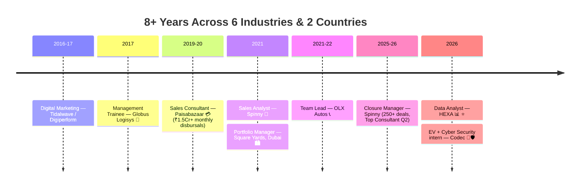

<!-- ═══════════════ HEADER ═══════════════ -->

**🪔 सत्य · परिश्रम · प्रगति — Data · Supply Chain · AI, built the Bharat way 🇮🇳**

### 🗂️ Open a Panel in Full

🪔 ✦ ☸️ ✦ 🪔

<!-- ═══════════════ KPI STRIP ═══════════════ -->

## 📟 Career KPI Board

---

<!-- ═══════════════ DASHBOARD GRID ROW 1 ═══════════════ -->
<table width="100%">
<tr>
<td width="50%" valign="top">

### 🟢 LIVE — Current Panel

| Signal | Status |
|---|---|
| 💼 **Role** | Data Analyst @ **HEXA Solutions** |
| 📍 **Base** | Ghaziabad, NCR, India 🇮🇳 |
| ⚡ **Side engagements** | micro1 (AI Trainer) · Zidio (DS&A) · CadetX (Analytics+AI) · GWEN (UX) · **Codec Technologies (EV + Cyber Security)** |
| 📚 **Learning** | AI-First PM · RAG & Agents · SAP MM · EV systems · Cybersecurity · German A1 🇩🇪 |

| 🎯 **Targeting** | Sr Manager / AVP — Analytics · SCM · Ops |
| 🌍 **Open to** | India · EU (Blue Card) · Gulf · Immediate |

</td>
<td width="50%" valign="top">

### 🧠 Skill Radar

| Domain | Level |
|---|---|
| 📊 Excel / Dashboards | 🟧🟧🟧🟧🟧 |
| 🔍 EDA & Statistics | 🟧🟧🟧🟧⬜ |
| 🗃️ SQL | 🟧🟧🟧🟧⬜ |
| 🐍 Python (Pandas/Sklearn) | 🟧🟧🟧🟧⬜ |
| 📈 Power BI / Tableau | 🟧🟧🟧🟧⬜ |
| 🤖 AI Tools / Prompting | 🟩🟩🟩🟩🟩 |
| 🛡️ Cyber Security (VAPT/Crypto/IDS) | 🟩🟩🟩🟩⬜ |
| 🚚 Supply Chain Ops | 🟩🟩🟩🟩🟩 |

</td>
</tr>
</table>

---

<!-- ═══════════════ TECH TICKER ═══════════════ -->

### 🛠️ Tool Belt

---

<!-- ═══════════════ DASHBOARD GRID ROW 2 ═══════════════ -->
<table width="100%">
<tr>
<td width="50%" valign="top">

### 📊 Portfolio Panel — Repos

| Repo | Contents |
|---|---|
| 📊 [`hexa-data-analytics-portfolio`](https://github.com/YOUR-USERNAME/hexa-data-analytics-portfolio) | **13 projects** — EDA · SQL · ML · API · dashboards |
| 🧭 [`product-management-case-studies`](https://github.com/YOUR-USERNAME/product-management-case-studies) | **7 cases** — Uber · Zepto · Nykaa · B2B SaaS · Blinkit |
| 🔌🛡️ [`Codec-Technologies-Internship-Projects-2026`](https://github.com/YOUR-USERNAME/Codec-Technologies-Internship-Projects-2026) | **30 projects** — 10 EV engineering + 20 defensive cyber security · **452 tests** |

**Verified headline figures:**
🏙️ Dubai model → **99 AED/sqft** · 🛒 Flipkart CSAT → **4.48→3.66** · ⌚ Fitness corr → **r = −0.60** · 🔋 BMS EKF SOC RMSE → **0.63 %** · 🛡️ ML IDS F1 → **0.998**

➡️ [All 50+ projects](./PROJECTS.md) · [🧪 58+ simulations](./SIMULATIONS.md) · [✍️ Publications](./PUBLICATIONS.md)

</td>
<td width="50%" valign="top">

### 🏅 Credential Panel

🚚 <b>Supply Chain</b> (8)

IIM Ahmedabad SC Digitization · CSCMP SCPro (6 domains) · Six Sigma Black Belt · PGDLSCM · PepsiCo SC Stars · Flipkart SCOA · 2× LinkedIn Learning SCM

📊 <b>Data & BI</b> (5)

Google Data Analytics · Google BI · Google Project Mgmt · Entri PG Data Analytics *(in progress)* · 58+ Forage simulations

🤖 <b>AI</b> (7)

Anthropic AI Fluency ×2 · Claude 101 · Agent Skills · Outskill AI Generalist · Airtribe AI-First PM · Azure AI path *(in progress)*

🔌🛡️ <b>Engineering & Security</b> (Codec Technologies)

Electric Vehicle intern · Cyber Security intern · Digital Electronics & VLSI intern · Robotics & Automation intern · GraySentinel Blue-Team/SOC trainee

💼 <b>Sales & CRM</b> (3)

Salesforce Administrator · PepsiCo Sales Star · SAP MM *(in progress)*

</td>
</tr>
</table>

---

<!-- ═══════════════ ADVANCED WIDGETS ═══════════════ -->

### 📈 GitHub Telemetry

---

<!-- ═══════════════ EXPERIENCE SNAPSHOT ═══════════════ -->
## 🕐 Journey Monitor

| 🏢 | Role | Key Number |
|---|---|---|
| **HEXA Solutions** | Data Analyst 🟢 | 13-project portfolio |
| **Codec Technologies** | EV + Cyber Security intern 🟢 | 30 projects · 452 tests |
| **Spinny** | Closure Manager | 250+ deals · **18% closure lift** · 4.8/5 CSAT |
| **Square Yards, Dubai** | Portfolio Manager | 100+ HNI · 15+ nationalities · **90% retention** |
| **Paisabazaar** | Sales Consultant | **28% conversion** · ₹1.5Cr+/month |
| **OLX Autos** | Team Lead | **87% FCR** |

| **Globus Logisys** | Mgmt Trainee | **30% stockout ↓** · 22% cycle-delay ↓ |

---

<!-- ═══════════════ WHY I'M A FIT ═══════════════ -->
## ✅ Why I'm a Strong Fit — The 60-Second Case

> **One line:** I pair **8+ years of frontline operating experience** across six industries with a **modern analytics + AI + engineering toolkit** — so I don't just read the numbers, I've *worked the process behind them*.

| What senior roles need | The proof I bring |
|---|---|
| 🎯 **Deliver measurable business impact** | ₹13.5 Cr+ sales facilitated · 30% stockout ↓ · 22% cycle-delay ↓ · 18% closure-rate lift · 92%+ CSAT |
| 📊 **Turn data into decisions** | 13 end-to-end analytics projects (EDA → SQL → ML → BI) with a *verified-figures, no-fabrication* discipline |
| 🧭 **Own product & strategy thinking** | 7 PM case studies using Five Forces · JTBD · RICE · STP, each with a live financial model |
| ⚙️ **Go technically deep when needed** | 30 engineering/security projects (EV systems + cyber) with **452 automated tests passing** |
| 🌍 **Operate across cultures & geographies** | Dubai HNI portfolio · 15+ nationalities · 4 languages · German A1 for the EU Blue Card track |
| 🔁 **Learn fast, sustainably** | 16 core certifications + 58+ Forage simulations completed *alongside* full-time work |
| 🤖 **Be AI-native, not AI-curious** | 4× Anthropic credentials · AI-First PM cohort · RAG/agents · AI trainer role at micro1 |

**Best-fit roles:** Sr Manager / AVP — **Data Analytics**, **Supply Chain**, **Operations**, or **AI Product**.
📄 Full evidence in [Experience](./EXPERIENCE.md) · [Projects](./PROJECTS.md) · [Certifications](./CERTIFICATIONS.md).

---

<!-- ═══════════════ CONTACT FOOTER ═══════════════ -->

## 📡 Comms Panel

**Open to Senior Manager / AVP roles — Data Analytics · Supply Chain · Operations**

🇮🇳 PAN-India · 🇪🇺 Germany (Blue Card track) · 🌴 Gulf | Immediate joiner

🪔 ✦ ☸️ ✦ 🪔

