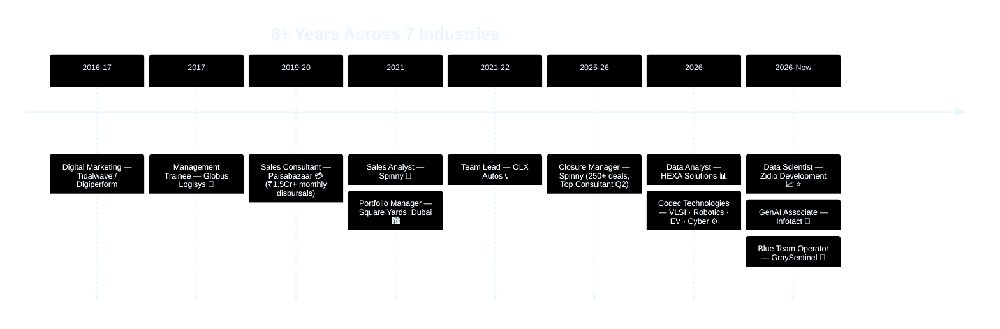

<!-- ═══════════════ HORIZON 2047 THEME · HEADER ═══════════════ -->

### 🔱 Open a Panel in Full

### 🪔 Capability Panels

## 📿 Career KPI Board

<!-- ═══════════════ DASHBOARD GRID ROW 1 ═══════════════ -->
<table width="100%">
<tr>
<td width="50%" valign="top">

### 🔥 LIVE — Current Panel

| Signal | Status |
|---|---|
| 💼 **Role** | Data Scientist @ **Zidio Development** (Data Science & Analytics) — **Project FORESIGHT** demand-forecast platform [live](https://foresight-northbay.netlify.app), WAPE 8.8 % vs 11.2 % seasonal-naive |
| 📍 **Base** | Ghaziabad, NCR, India |
| 🧠 **Also** | Infotact Solutions — Associate L1, Generative AI (LLM apps · RAG) · GraySentinel DSOU — Blue Team Operator · CadetX — warehouse analytics squad · micro1 — AI Trainer |
| ✅ **Completed 2026** | HEXA Solutions — Data Analyst (13 projects) · Codec Technologies — 4 engineering tracks, 50 projects |
| 📚 **Learning** | AI-First PM — 12 cases (latest: Airbnb PLG · QuickBite & SkillBridge system design) · now *AI in Product Management* module · SAP MM · German A1 🇩🇪 |
| 🎯 **Targeting** | Sr Manager / AVP — Analytics · SCM · Ops |
| 🌍 **Open to** | India · EU (Blue Card) · Gulf · Immediate |

</td>
<td width="50%" valign="top">

### 🧿 Skill Radar

| Domain | Level |
|---|---|
| 📊 Excel / Dashboards | 🟦🟦🟦🟦🟦 |
| 🔍 EDA & Statistics | 🟦🟦🟦🟦⬛ |
| 🗃️ SQL | 🟦🟦🟦🟦⬛ |
| 🐍 Python (Pandas/Sklearn) | 🟦🟦🟦🟦⬛ |
| 📈 Power BI / Tableau | 🟦🟦🟦🟦⬛ |
| 🤖 AI Tools / Prompting | 🟦🟦🟦🟦🟦 |
| 🚚 Supply Chain Ops | 🟦🟦🟦🟦🟦 |
| 🔌 Digital Design (Verilog/VHDL/FPGA) | 🟦🟦🟦⬛⬛ |
| 🤖 Robotics Algorithms (SLAM/PID/IK) | 🟦🟦🟦⬛⬛ |
| 🔵 Defensive Security (Sigma / SOC) | 🟦🟦🟦⬛⬛ |

</td>
</tr>
</table>

<!-- ═══════════════ TOOL BELT ═══════════════ -->

### 🛠️ Tool Belt

<!-- ═══════════════ DASHBOARD GRID ROW 2 ═══════════════ -->
<table width="100%">
<tr>
<td width="50%" valign="top">

### 📦 Portfolio Panel — Repos

| Repo | Contents |
|---|---|
| 📊 [`hexa-data-analytics-portfolio`](https://github.com/Eswar5313/hexa-data-analytics-portfolio) | **13 projects** — EDA · SQL · ML · API · dashboards |
| 🧭 [`product-management-case-studies`](https://github.com/Eswar5313/product-management-case-studies) | **12 cases** — Uber · Zepto · Nykaa · B2B SaaS · Blinkit · VitaFit PRD · Zomato funnel · **Airbnb PLG · QuickBite · SkillBridge Compass** |
| ⚙️ [`Codec-Technologies-Internship-Portfolio-2026`](https://github.com/Eswar5313/Codec-Technologies-Internship-Portfolio-2026) | **50 projects** — VLSI · Robotics · EV · Cyber · 50 report PDFs · [live dashboard](https://eswar5313.github.io/Codec-Technologies-Internship-Portfolio-2026/) |
| 📈 [`zidio-data-science-projects`](https://github.com/Eswar5313/zidio-data-science-projects) — **Project FORESIGHT** | **Live** — [foresight-northbay.netlify.app](https://foresight-northbay.netlify.app) · weekly SKU forecast + stockout/overstock risk scoring + `/api/score` service · WAPE **8.8 %** vs 11.2 % naive |
| 🔵 [`GraySentinel-DSOU-45Day-2026`](https://github.com/Eswar5313/GraySentinel-DSOU-45Day-2026) | **Blue Team programme** — Day 1 Zero-Day lab + Sigma rule · Day 2 macOS miner chain · Auth-Log Investigation Tool · SOC Incident Summary Generator · 25 tests · root dashboard |
| 🏗️ [`Cadetx-Junior-DA`](https://github.com/Eswar5313/Cadetx-Junior-DA) | **Heavy Warehouse Intelligence** — 12-sprint warehouse & supplier analytics (6 branches · 30 SKUs · 8 suppliers · 2019–24) |
| 🎓 [`Internship-Studio-Projects-2026`](https://github.com/Eswar5313/Internship-Studio-Projects-2026) | **18 subject projects** — AI · data science · testing · C++ · energy · RCC · finance · HR · AWS · export finance |
| 🗂️ [`Eswar-Master-Project-Portfolio-2026`](https://github.com/Eswar5313/Eswar-Master-Project-Portfolio-2026) · [`Eswar-Portfolio-Lens-Index-2026`](https://github.com/Eswar5313/Eswar-Portfolio-Lens-Index-2026) | **110+ projects** in one navigable registry, plus 10 lenses (skills · tools · sectors · roles · methods…) |

**Verified headline figures:**
🏙️ Dubai model → **99 AED/sqft** · 🛒 Flipkart CSAT → **4.48→3.66** · ⌚ Fitness corr → **r = −0.60** · 🔌 UART on iCE40 → **135 MHz** · 🔋 CMOS ALU power → **−63.8 %** · 🤖 SLAM pose RMSE → **0.34 m** · 📈 FORESIGHT forecast → **WAPE 8.8 % vs 11.2 % naive** · 🍽️ Zomato funnel → **17.6 % → 26.4 % delivered target**

➡️ [All 100+ projects in detail](./PROJECTS.md) · [🧪 66 job simulations](./SIMULATIONS.md) · [✍️ Publications](./PUBLICATIONS.md)

</td>
<td width="50%" valign="top">

### 🏅 Credential Panel

🚚 <b>Supply Chain</b> (8)

IIM Ahmedabad SC Digitization · CSCMP SCPro (6 domains) · Six Sigma Black Belt · PGDLSCM · PepsiCo SC Stars · Flipkart SCOA · 2× LinkedIn Learning SCM

📊 <b>Data & BI</b> (5)

Google Data Analytics · Google BI · Google Project Mgmt · Entri PG Data Analytics *(in progress)* · 66 Forage simulations

🤖 <b>AI</b> (7)

Anthropic AI Fluency ×2 · Claude 101 · Agent Skills · Outskill AI Generalist · Airtribe AI-First PM · Azure AI path *(in progress)*

💼 <b>Sales & CRM</b> (3)

Salesforce Administrator · PepsiCo Sales Star · SAP MM *(in progress)*

🔵 <b>Security & Engineering</b> (5)

GraySentinel DSOU Day 1 Zero-Day certificate · Codec Technologies — Cyber Security · Electric Vehicle · Digital Electronics & VLSI · Robotics & Automation

</td>
</tr>
</table>

<!-- ═══════════════ RECENT ADDITIONS ═══════════════ -->

### 🆕 Recent Additions — September → October 2026

| Date | What shipped | Proof |
|---|---|---|
| 3 Oct | **PM Case Notes** blog live — VitaFit PRD · Zomato funnel · Airbnb PLG | [Live](https://eswar-pm-case-notes.netlify.app) |
| 27 Sep | **SkillBridge "Compass"** learning-recommendation system design (hybrid batch + real-time re-rank) and **QuickBite** 5k → 2M-user rollout design brief | [PM cases](https://github.com/Eswar5313/product-management-case-studies) |
| 25 Sep | Joined **Infotact Solutions** as Associate L1 — Generative AI (LLM apps · RAG · evaluation) | [Experience](./EXPERIENCE.md) |
| 24 Sep | 3D portfolio site live — talking-head intro, office / WFH / learning-lab stage | [Live](https://eswar-3d-portfolio.netlify.app) |
| 22 Sep | **Airbnb India PLG** case — 6 loops, 4 MVPs, revenue model · Internship Studio #17 export-finance model (confirmed sight LC, PV USD 579,735) | [PM cases](https://github.com/Eswar5313/product-management-case-studies) · [IS repo](https://github.com/Eswar5313/Internship-Studio-Projects-2026) |
| 15 Sep | GraySentinel repo root dashboard covering Day 1 lab, Day 2 lab, Project 01, Project 02 | [GraySentinel-DSOU-45Day-2026](https://github.com/Eswar5313/GraySentinel-DSOU-45Day-2026) |
| 14 Sep | **SOC tools** — Authentication Log Investigation Tool + SOC Incident Summary Generator (stdlib Python, RFC-5737 lab data, 13 + 12 tests, GitHub Pages live checker) | [graysentinel-day1/](https://github.com/Eswar5313/GraySentinel-DSOU-45Day-2026) |
| 13 Sep | **Zomato funnel & cohort metrics** — 7-stage funnel (17.6 % → 26.4 % target), 6 cohorts, North Star + 13 metric ladders, 163-formula workbook, 10-slide deck, 53-pp master | [PM cases](https://eswar5313.github.io/Eswar-Master-Project-Portfolio-2026/#02-Product-Management-Case-Studies) |
| 12 Sep | PM Craft Series — 3 essays on PM communication & PRD writing | [Publications](./PUBLICATIONS.md) |
| 10 Sep | GraySentinel Day 2 — macOS miner attack-chain lab (oletools → C2 → LaunchDaemon persistence), in progress | [GraySentinel-DSOU-45Day-2026](https://github.com/Eswar5313/GraySentinel-DSOU-45Day-2026) |
| 9 Sep | **Project FORESIGHT** (Zidio) — NorthBay Living demand forecasting + inventory-risk platform, live on Netlify with scoring API; WAPE 8.8 % vs 11.2 % seasonal-naive on rolling-origin backtest | [Live](https://foresight-northbay.netlify.app) |
| 9 Sep | GraySentinel Day 1 — Zero-Day Discovery 6-phase lab certificate + 3-tripwire Sigma detection rule | [GraySentinel-DSOU-45Day-2026](https://github.com/Eswar5313/GraySentinel-DSOU-45Day-2026) |
| 4 Sep | Excel Module 1 three-part master — 42 sheets, 171,263 live formulas, 57 functions, 31 charts, 3 dashboards | [Excel Module](https://eswar5313.github.io/Eswar-Master-Project-Portfolio-2026/#05-Excel-Data-Analytics-Module) |

<!-- ═══════════════ EXPERIENCE TIMELINE ═══════════════ -->
## 🕉️ Journey Monitor

```mermaid
%%{init: {'theme':'base','themeVariables':{'primaryColor':'#0B1026','primaryTextColor':'#E8F6FF','primaryBorderColor':'#00E5FF','lineColor':'#B388FF','secondaryColor':'#12062B','tertiaryColor':'#1B1F4B','fontFamily':'Orbitron, Segoe UI, sans-serif'}}}%%
timeline
    title 8+ Years Across 7 Industries
    2016-17 : Digital Marketing — Tidalwave / Digiperform
    2017 : Management Trainee — Globus Logisys 🚚
    2019-20 : Sales Consultant — Paisabazaar 💳 (₹1.5Cr+ monthly disbursals)
    2021 : Sales Analyst — Spinny 🚗 : Portfolio Manager — Square Yards, Dubai 🏙️
    2021-22 : Team Lead — OLX Autos 📞
    2025-26 : Closure Manager — Spinny (250+ deals, Top Consultant Q2)
    2026 : Data Analyst — HEXA Solutions 📊 : Codec Technologies — VLSI · Robotics · EV · Cyber ⚙️
    2026-Now : Data Scientist — Zidio Development 📈 ⭐ : GenAI Associate — Infotact 🧠 : Blue Team Operator — GraySentinel 🔵
```

| 🏢 | Role | Key Number |
|---|---|---|
| **Zidio Development** | Data Scientist 🔥 | **Project FORESIGHT live** · WAPE 8.8 % vs 11.2 % naive · 8 reorder / 8 markdown / 34 healthy SKUs |
| **GraySentinel Cyber Defence Lab** | Blue Team Operator & Trainee | Zero-Day lab cert · Sigma rule (ATT&CK T1053.003) · 2 SOC tools · 25 tests |
| **Infotact Solutions** | Associate L1 — Generative AI | LLM apps · RAG · prompt engineering (Sep 2026 →) |
| **Codec Technologies** | Engineering intern — 4 tracks (Aug–Sep 2026) | **50 projects · 595+ tests · 50 reports** |
| **HEXA Solutions** | Data Analyst (Jun–Sep 2026) | 13-project portfolio |
| **Spinny** | Closure Manager | 250+ deals · **18% closure lift** · 4.8/5 CSAT |
| **Square Yards, Dubai** | Portfolio Manager | 100+ HNI · 15+ nationalities · **90% retention** |
| **Paisabazaar** | Sales Consultant | **28% conversion** · ₹1.5Cr+/month |
| **OLX Autos** | Team Lead | **87% FCR** |
| **Globus Logisys** | Mgmt Trainee | **30% stockout ↓** · 22% cycle-delay ↓ |

<!-- ═══════════════ EDUCATION + STATS ═══════════════ -->
<table width="100%">
<tr>
<td width="45%" valign="top">

### 🎓 Education Panel

| Degree | Institution |
|---|---|
| **MBA** — Ops & Marketing *(First Class)* | SRM IST, Chennai |
| **B.Com** | University of Madras |
| **PG Diploma** — Logistics & SCM | — |

**Languages:** English · Hindi · Tamil · Telugu · German 🇩🇪 A1

</td>
<td width="55%" valign="top">

### 📈 GitHub Telemetry

</td>
</tr>
</table>

<!-- ═══════════════ CONTACT FOOTER ═══════════════ -->

## 📡 Comms Panel

**Open to Senior Manager / AVP roles — Data Analytics · Supply Chain · Operations**
🇮🇳 PAN-India · 🇪🇺 Germany (Blue Card track) · 🌴 Gulf | Immediate joiner

