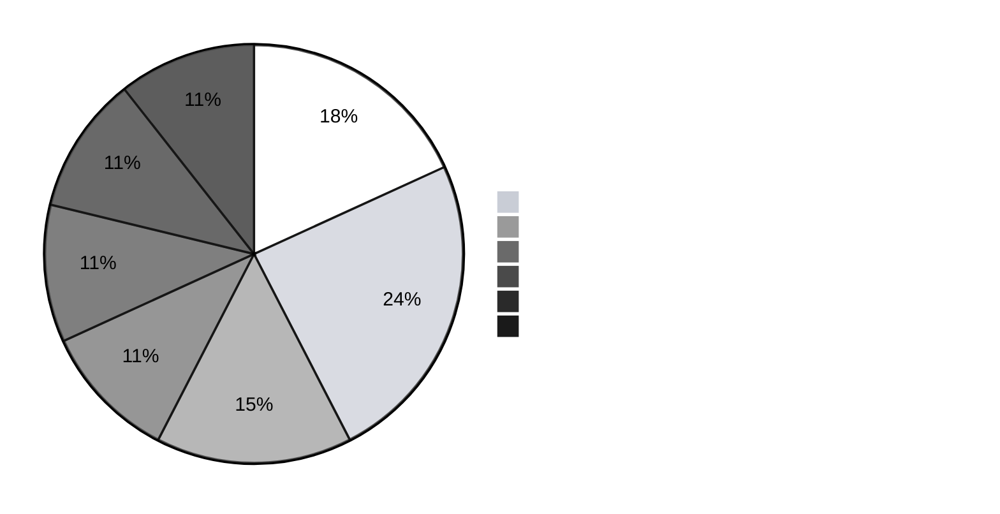

<!-- ═══════════════ HORIZON 2047 · SIMULATIONS ═══════════════ -->

   

<table><tbody>
<tr><td align="right"><b>WHO I AM</b></td><td>  </td></tr>
<tr><td align="right"><b>WHAT I BUILT</b></td><td>  </td></tr>
<tr><td align="right"><b>WHAT I CAN DO</b></td><td>  </td></tr>
<tr><td align="right"><b>WHERE I HAVE WORKED</b></td><td>  </td></tr>
<tr><td align="right"><b>HOW I WORK</b></td><td>   </td></tr>
<tr><td align="right"><b>WHY HIRE ME</b></td><td>     </td></tr>
</tbody></table>

**What these are:** Forage job simulations are task-based virtual work experiences designed by real companies — you complete the actual deliverables their teams produce (analysis decks, models, briefs), not quizzes.

## 🏭 View 1 — By Sector & Company

> **66 completed simulations, 7 sector groups.** Company names as they appear on my Forage certificates; four flagship simulations (Tata GenAI · GE Aerospace Supply Chain · BCG Data Science · Quantium Data Analytics) are also featured on my LinkedIn. Certificates available on request.

| | Sector group | Count | Companies | Skill proven |
|---|---|:-:|---|---|
| 🏦 | **Banking, Markets & Asset Management** | 12 | Bloomberg ×2 · Bank of America · Mastercard · Commonwealth Bank · Wells Fargo ×2 · BNY · Goldman Sachs · HSBC · PGIM · AIG | Financial analysis · markets · risk · client advisory |
| ⚖️ | **Legal & Governance** | 16 | A&O Shearman · Allens · Ashurst ×3 · Bryan Cave Leighton Paisner ×2 · Clifford Chance ×3 · Herbert Smith Freehills · King & Wood Mallesons · Leo Cussen · Marrickville Legal Centre · Mayer Brown · Watson Farley & Williams | Structured review · compliance · commercial reasoning · client memos |
| 💻 | **Technology, Data & AI** | 10 | Tata Group (GenAI) · Quantium (Data Analytics) · AWS · Datacom · Hewlett Packard Enterprise ×2 · Comcast · nbn co · Siemens ×2 | Data analytics · GenAI use-cases · cloud · engineering thinking |
| 🧭 | **Consulting, Audit & Tax** | 7 | BCG (Data Science) · Deloitte · PwC US · PwC Switzerland · Ryan · Third Bridge · EAB | Problem structuring · audit logic · data-science framing |
| 🚚 | **Supply Chain, Retail, Industrial & Real Estate** | 7 | GE Aerospace (Supply Chain) · GE (HR) · Walmart ×2 · CBRE ×2 · Johnson & Johnson (Robotics) | Network & inventory thinking · retail ops · facilities · automation |
| 🍫 | **FMCG, Consumer & Life Sciences** | 7 | PepsiCo · Diageo · Unilever · LVMH · Red Bull · Pfizer · LifeArc | Consumer analytics · brand & GTM · regulated-industry operations |
| 🏛️ | **Public Sector, Media & Foundations** | 7 | NSW Government ×2 · The New York Times · Vista · Omnichannel · Forage Academy ×2 | Policy analysis · audience insight · core workplace skills |
| | **Total** | **66** | | |

## 🎯 View 2 — Why 66 Simulations = Versatility for Bigger Roles

| What a Senior Role Demands | How Simulations Prove It |
|---|---|
| 🌍 **Cross-functional fluency** | Completed real deliverables across finance, tech, FMCG, consulting & ops — I speak every department's language in one meeting |
| 🏢 **Big-company process exposure** | Worked through Fortune-500-designed workflows before ever joining one — lower ramp-up time |
| 🔁 **Learning velocity** | 66 simulations completed alongside full-time work — evidence of sustained self-directed upskilling |
| 🧩 **Pattern recognition** | Seeing how *different* industries solve the *same* problems (forecasting, prioritization, stakeholder comms) — the core skill of an AVP who moves between domains |
| 🤝 **Stakeholder empathy** | Sims span analyst, consultant, marketer & ops seats — I've sat in the chairs of the people I'd manage |

> **The honest framing:** simulations are not jobs — they're structured proof of range and initiative. My depth comes from [8+ years of real roles](./EXPERIENCE.md); simulations show the *breadth* on top.

**Eswar Mahalingam** · MBA · CSCMP SCPro · Six Sigma Black Belt · Ghaziabad NCR, India · Open to India · EU (Blue Card) · Gulf · Immediate joiner

